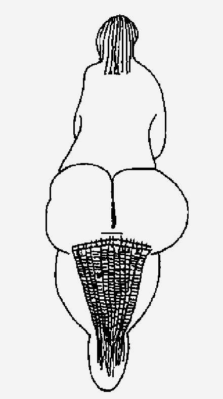
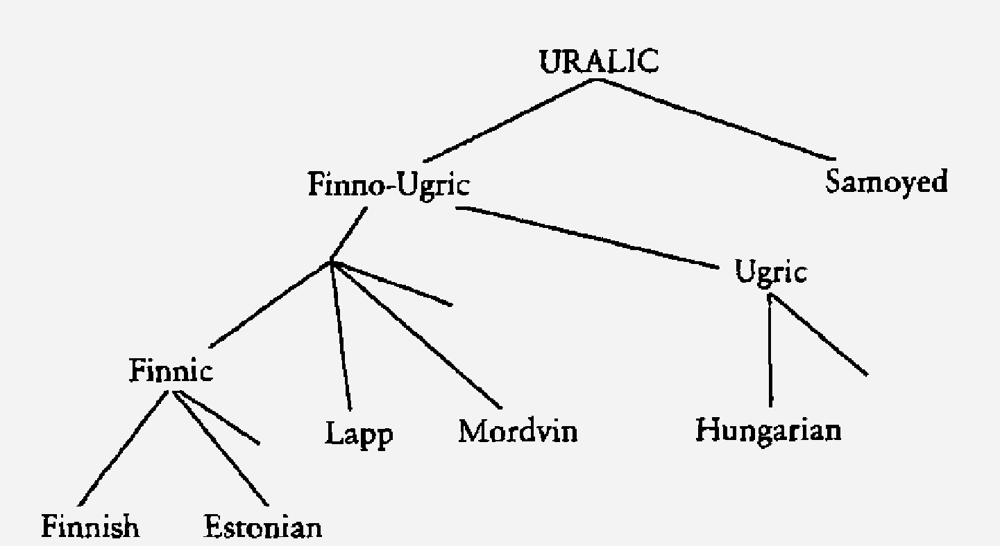
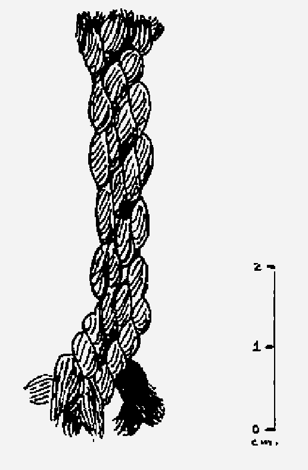
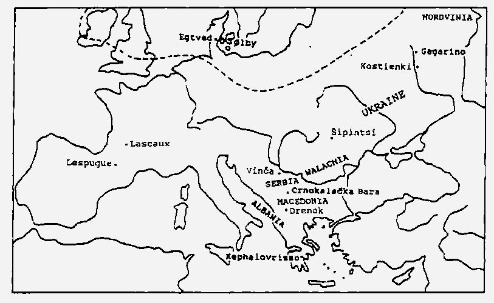
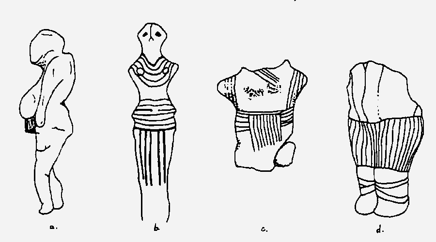
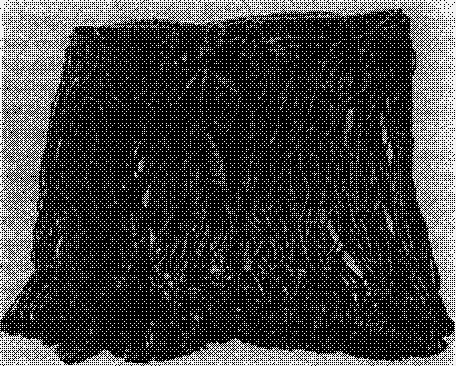
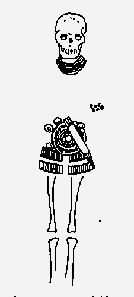
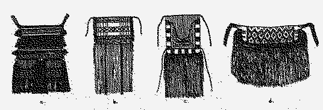
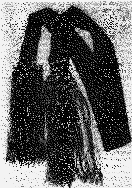
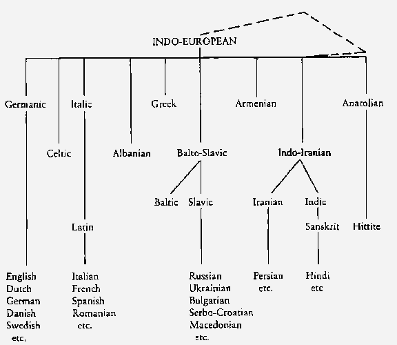

> ... a threefold cord is not quickly broken.
— Ecclesiastes 4:12

Some forty thousand years ago, at the beginning of the last phase of the Old Stone Age (called the Upper Paleolithic), human beings began to act very differently from the way they ever had before. For some two million years they had fashioned simple stone tools, and for half a million they had controlled fire and hunted cooperatively in groups. But forty thousand years ago, as the great ice sheets that had covered the northern continents retreated by fits and starts, humans started to invent and make new things at a tremendous rate, like a slow-ascending firecracker that suddenly explodes into a thousand sparks of varied color, shooting in a thousand directions.

These newly creative hunter-gatherers produced novel tools—such as awls, pins, and various chisel-like burins—but they also began to sculpt animals, people, and other information (possibly calendrical) on pieces of ivory and bone and to make quantities of beads for adornment. People of the Upper Paleolithic painted pictures of animals and drew around their own hands on cave walls; this is the period of the famous Stone Age paintings from Lascaux, Altamira, and other caves in France and Spain. Just as important, and more to our purpose here, these ancestors invented string and sewing and thus provided the first chapter in the story of women's long association with the fiber crafts. As near as we can place it, the event occurred twenty to thirty thousand years ago, right in the middle of the Upper Paleolithic. While others were painting caves or knapping fancy flints, some genius hit upon the principle of twisting handfuls of little weak fibers together into long, strong thread. How do we know this? Nothing so perishable has survived those twenty-five to thirty-five thousand years, although by some miracle one bit of neatly spun and plied cordage has made it through from about 15,000 B.c. (see below). Our earliest evidence is indirect. We infer this humble yet crucial invention from significant changes in other objects of a sturdier nature. The Upper Paleolithic culture known to paleontologists as the Gravettian (from the name of the French site where it was first recognized: La Gravette, on the Dordogne River) seems to have sprung up in central and eastern Europe, spreading gradually westward along the south edge of the great ice sheet to southern France and Spain. Radiocarbon dates suggest that the Gravettian culture lasted roughly six thousand years, from 26,000 to 20,000 B.C. During this vast time needles become common, and beads of shell, tooth, and bone turn up with increasingly small holes. The smaller beads, moreover, begin to occur arranged in neat rows across the bones (sometimes the skulls) of the deceased. Clearly these beads had been sewn onto garments, made probably of hide. In a cave near the Mediterranean border between modern France and Italy; an adolescent young man was found carefully interred wearing a cap or hairnet sewn or strung with four tidy rows of tiny shell beads. His body lay protectively around that of a smaller and much older woman—his mother?—who wore a bracelet of similar beads. From such artifacts alone one can deduce a knowledge of sewing. But there is proof that at least some of the thread in use had

*Figure 2.1. Small Paleolithic Venus figure found at Lespugue, France, carved of bone ca. 20,000 B.r:. (Gravettian culture). The woman wears a skirt made of twisted strings suspended from a hip band. Such skirts seem to have been associated with childbearing. been twisted together from small natural fibers, rather than cut from long, stringy body parts like gut or sinew. It comes from a bone sculpture of a woman wearing a skirt made of string (fig. 2.1)*

This small, plump "Venus figure" (a nickname for all the little bone, stone, and ivory figurines of women from the Paleolithic) comes from Lespugue, in southern France, and is probably of late Gravettian manufacture. Her skirt consists of long strings hanging down the back from a hip band, and the ancient sculptor has troubled to engrave the twists in each string. Furthermore—a detail I did not notice until I began to make my own drawing from a large, clear photograph obtained from the Musée de l'Homme in Paris— the sculptor has shown the strings fraying out at the bottom into a mass of untwisted fibers. These cannot be thongs of sinew or hide; they can only be true twisted-fiber thread.

We don't know how early to date this great discovery—of making string as long and as strong as needed by twisting short filaments together. But whenever it happened, it opened the door to an enormous array of new ways to save labor and improve the odds of survival, much as the harnessing of steam did for the Industrial Revolution. Soft, flexible thread of this sort is a necessary prerequisite to making woven cloth. On a far more basic level, string can be used simply to tie things up—to catch, to hold, to carry. From these notions come snares and fishlines, tethers and leashes, carrying nets, handles, and packages, not to mention a way of binding objects together to form more complex tools. Nets, for example, work so efficiently that nowadays they are mostly illegal for catching fish in fresh water. Sportsmen don't consider netting sufficiently "sporting," and furthermore, in no time there would be no fish left to spawn more.) So powerful, in fact, is simple string in taming the world to human will and ingenuity that I suspect it to be the unseen weapon that allowed the human race to conquer the earth, that enabled us to move out into every econiche on the globe during the Upper Paleolithic. We could call it the String Revolution.

What was it like to live in this busy new world, so different from ages past, yet a world still without houses, stoves, and refrigerators, with nothing but rocks and wild plants and animals to supply all one's needs? The stones and bones of archeology yield but a dry and lifeless picture, and a very incomplete one at that.

We can recognize an ancient campsite (if we are lucky enough to find one) by small deposits of ashes and carbon in places where a controlled fire burned. Stone tools of the Paleolithic may well have survived, too, known by their deliberately chipped edges and regular shapes. But stone is a hard medium to work. Ancient people undoubtedly used softer materials like wood, leather, and bark wherever these would do the job, but these softer things almost never survive even two thousand years, let alone twenty thousand. So we must recognize that we have lost most of the tools and trappings of that time. Furthermore, material remains tell us little about the intangible parts of culture: about marriage and dinner recipes and how the world was categorized. (Anyone who has ever learned a second language knows that different cultures look at the world differently, from what colors and how many of them form the rainbow to who is counted as kin.)

Using the excavated finds as a firm pedestal, however, we can now turn a backward-looking spyglass built from the linguistic reconstruction of early languages to catch some lively glimpses of that archaic world. Words, as it happens, sometimes survive the millennia better than material objects, and they do so best in areas in which the culture changed only very slowly—as in the far north, where the intense winter cold discouraged immigrants. [^1]

All across Europe to the north of the linguistically numerous Indo-Europeans[^2] live speakers of the Uralic language family (fig. 2.2). Their modern tongues include Finnish, Estonian, and Lappish in the northwest, plus Mordvin and a great many others in Russia, all the way into Siberia just east of the Ural Mountains. Hungarian, too, belongs to this group, its speakers having moved into central Europe from the Urals only a thousand years ago. But as near as we can tell, the Uralic speakers of the far north are the "original" inhabitants of that area, at least since the late Ice Age. That is, they followed the retreating ice sheets—and the great herds of tundra animals—into the newly emerging land toward the end of the Palaeolithic. While the inhabitants of the Near East and southeastern Europe began to settle down and develop new ideas of exploiting plants and animals through domestication and farming (the stage we call the Neolithic: see fig. 0.3 and Chapter 3), the people north of this busy center continued for thousands of years in much the old way, adopting only a few new ideas from the Neolithic south. This short transitional phase we call the Mesolithic, or Middle Stone Age. It lasted there from roughly 10,000 to 4000 B.c. or later.

*Figure 2.2. Tree chart showing the relationship among some of the languages in the Uralic family, which extends across much of northern Eurasia. Over many millennia the modern Uralic languages (at the bottom) have slowly diverged in form from a common parent (at the top).*

The Swedish scholar Björn Collinder spent much of his life collecting and comparing the vocabulary of the various Uralic languages. Using the words that appeared in several Uralic branches, he divided his material into those terms which were clearly loans (mostly from Indo-European sources) and those which were not—terms already part of the language when the speakers of early Uralic, like those of early Indo-European, began to spread. Reading through the "native" part of Collinder's comparative dictionary is like going on a visual walk through the Mesolithic or the late Palaeolithic. With the possible exception of terms that may already refer to herding reindeer (semidomestication), and a single term referring to metal, the native expressions common to these languages suffice to account only for a Mesolithic economy, whereas words for agriculture and the specific metals are later borrowings.[^3] (The italicized expressions in what follows represent the English meanings of words in the vocabulary common to Uralic speakers.)

We see, through the terms, that this land was little different from the tundra zone of the far north today. For example, their words tell us that they lived among rivers, lakes, swamps, and forests. They encountered snowstorms and snowdrifts and trampled snow, but they also had a verb for keeping warm, as well as words for fire and coals. Summer was, understandably, called thaw-time.

What might life have been like on a bright morning in thaw-time? The prime objective, of course, was to get food for the day—and more if possible, to preserve for the winter ahead. As in other preagricultural societies, with no crops to provide a regular food source, the women and children undoubtedly spent much of the day gathering wild plant food close to camp (a fairly safe task), while the men wandered farther afield hunting animal food. To deal with the youngest children while they gathered, the women had portable cradles, probably made from short poles and soft hides. To help in their collecting, they fashioned containers such as baskets and birchbark pails, by peeling the bark from birch, willow, and linden trees.

Among the tastiest things to collect were the various sorts of wild berries and seeds that ripened through the summer, as well as eggs from the nests of the many birds that roosted there. (As for species, we hear of grouse, sparrows, and crows.) But these people also knew of intoxicating mushrooms, which they almost certainly collected from time to time for ritual purposes. Narcotics of all sorts seem always to have been in demand for hallucinogenic rituals. By their means the participants could quickly come to see the inhabitants of the spirit world—dead ancestors and the like—of whom they could inquire about the future, cures for illness, lost objects, or other mysteries.

Collecting had its little hazards. A variety of sticker bushes like nettle, thistle, and wild rose grew in the area, for which the inhabitants had a single name. After all, what you needed to know about them was not their botanical classification but the practical fact that those plants were the kind that hurt! The foragers also encountered snakes, lizards, worms, ants, and—scourge of the tundra—hungry little flies and midges. It is with relief that we catch sight of butterflies among the flying swarms.

The things collected may have included more than—for example, the soft local mosses, usable as stuffing for cushions and sleeping pads. For although these early people did not have permanent houses, they built seasonal shelters of wood and perhaps hides, to shelter themselves as comfortably as possible from the elements while they moved around at intervals to follow the changing sources of food. In fact, they had a special word for tent poles, which they could have fashioned from aspen or poplar, spruce, fir, or any of the other abundant trees.

They also built raised wooden storage frames for hoards of food to be preserved for leaner seasons. The seeds kept well just as they were, while berries, fish, and thin strips of meat could be dried for later use. But to keep these precious Stores safe from the prowling wolves and other predators, they had to build protective fences.

While the women gathered plants and eggs, the men presumably searched out moving prey; interestingly, they designated hunting and fishing with the same word. As weapons they could use nets, lines, traps, arrows, and knives. To stalk their prey, they had regular paths, and they knew how to ford streams. The quarry must have included animals like reindeer and hares, as well as fish of all sorts—especially types of salmon and pike. The snares we hear of may have been used to catch birds as well as fish. If the kill or the catch was big enough, sledges made with runners could serve to drag or carry it home.

Back at camp, when the food was brought in, there was much to do. The meat could be cut up with knives, some to be dried and preserved for winter, some to be eaten on the spot. We don't know who did the cooking, but we can deduce that soup or porridge often graced the menu. To make it, they hailed the ingredients in water and fished them out of the cooking pot with a ladle. They also knew how to roast food on a spit. Fat and oil were so important to this cold-climate diet that they merited several terms.

There were other jobs besides preparing the food. The warm furs of hares, reindeer, and foxes needed to be prepared and pre-served fot winter wraps by carefully scraping the hides, The baskets and birchbark pails, as well as the hunting and fishing nets, lines, and snares, needed making and later mending. To manufacture the latter and to sew the hides, string was prepared from fiber plants (which, like the sticker bushes, got a single catchall function-based name) or from stringy body parts—indiscriminately gut, sinew, veins, or tendon. These people also knew how to twist various fibers into rope to tie things up and into thinner thread to stitch on patches and fasteners with the help of a needle.

In their bags of tools, besides knives, needles, and string, they had picks, flints, combs, scoops, and glue, along with borers for boring holes. They tell us they also knew how to carve. Of some of these early activities we have the physical remains, but we wouldn't have known about gluing, for instance, if they hadn't left the words behind.

During at least some months (moan-ths) of the year, the camps must have included more than just a mother and father with their children because terms for both the older and younger male and female relations of both husband and wife have come down to us. So we can imagine them sitting around the campfire of an evening in larger groups, making and mending tools and wraps while they swapped interesting stories of their adventures, of their friends or comrades and of the women's suitors. Sometimes people would wrangle, admonish, or curse and sometimes get high. But they also knew how to give presents and distribute goods. It is noteworthy that the word for language also sometimes meant "the news," "report," or "a legend." Despite the friends and relatives we noticed, there just weren't very many humans around yet, and news of anything at all, even a new technique or tool, must have seemed very interesting. (To get a sense of this, imagine how hungry for news you would feel upon being released from a snow-bound hut in Alaska after six months of winter.)

It would have been people living in a world much like this one, around 15,000 B.c., who produced our oldest preserved fiber artifact (fig. 2.3), a neatly made specimen found accidentally by the abbot A. Glory as he and other archaeologists were working in the famous painted caves of Lascaux, in southern France. He recounts the incident:

*Figure 2.3. Earliest preserved string, reconstructed: a heavy cord twisted from three two-ply fiber strings, found fossilized in the painted caves of Lascaux, France, ea. 15,000 B.C.*

> About two in the morning, exhausted with the work of copying the engravings on the ceiling of the apse, my helpers ... and I were going to relax by hunting for new drawings and by exploring new galleries. I picked up a compact lump of clay which sealed this fissure [running between two galleries]; the clod broke into several pieces, which I took into my hands with the intention of pulverizing them to verify their makeup. As I examined the profile of the first bit, ... I noticed a fine black line which crossed the surface from one end to the other.... Mechanically with the tip of the blade of my pocket knife I tapped at the unexpected black line ... The little lump of clay split open into two slabs like the leaves of a book. I saw immediately the carbonaceous imprint of a sort of fillet with twisted lines stretching the entire length of the lump. I interpreted this as the remains of a plaited vine, or some such thing. The second piece opened the same way, but the positive and negative traces appeared to me to represent a more complicated interlace. The third lump broke both lengthwise and crosswise, and the fourth was not touched, to serve as witness ... Intrigued by these unexpected finds, we dissected square by square the rest of the clay covering, but to our great disappointment we could disclose nothing further, except for numerous particles of soot as everywhere in this layer, resulting probably from the debris of the torches ... which had once served for light.... Seen [later] in the crisp light of day, there was no doubt possible: the fresh imprints, both concave and convex, in the first piece presented the very clear characteristics of a twisted cord formed of several strands on which one could distinguish even the puffiness of their twists."

Laboratory analysis showed the piece to have been made from vegetable fiber—too far disintegrated, alas, for tests to determine the plant species—and twisted from three two-ply cords (fig. 2.3). The plied cords, moreover, had each been formed by twisting their component strands in the other direction from that in which they had originally been spun. Such opposite twisting keeps the cord from coming apart once finished (see Chapter 1)—an important principle that craftworkers had discovered even at this early date. Abbot Glory concluded that the threefold cord had probably served to guide these early people down the dark and treacherous passage from one gallery of the cave to the other. Nor, as the proverb says, was it quickly broken.

We know for a fact, then, that twisted fiber string and thread were available in the Palaeolithic and that by 15,000 B.C. people possessed as much skill as anyone could wish for making cordage. After all, they had probably been practicing for five to ten thousand years already. Contrary to what one often reads in the literature, Palaeolithic peoples did not need to wait for the domestic plants and animals of the next great era, the New Stone Age, or Neolithic, to have fibers to use. For the relatively short lengths of string necessary for Palaeolithic tasks, an abundance of raw material lay for the taking in the wild.

Even today people unaccustomed to buying everything they want ready-made will manufacture bits of string and rope on the spot, using whatever is at hand. A Swedish archaeologist exploring central Asia in the 19305 described Chinese camel pullers in Mongolia who would "simply snatch a tuft from a camel shedding its hair and in a moment turn it into a piece of string for repairing a pack-saddle or the like, by twining it against the thigh...." In the absence of tame animals, however, wild plants will do quite as well. Flax, hemp, nettle, ramie, jute, sisal, esparto, maguey, yucca, elm, linden, willow—the list of usable plants goes on and on, in both the New World and the Old. Indeed, all the earliest string and thread that we possess consist of plant fiber, starting with the cord from Lascaux, from 15,000 B.C. and continuing with the finds of string and cloth preserved from early Neolithic sites in the Near East, between 7000 and 5500 B.C., and the earliest-known artifacts of cord, netting, and basketry in the New World, dating to 8500 to 6500 B.C.

Nor must one go through the long and laborious process of freeing the fibers from the woody matrix within which they grow, as we do with our crops of fiber plants. The winter weather does that quite well, if not so efficiently, to lone plants, slowly rotting away the plant material around the fibers. I have only to walk out into my yard and collect off the hack fence the long, dew-retted fibers of the passion fruit vine that volunteered to grow there last year. Singly the filaments will readily snap if I tug at them, but collected in a bundle and given a few twists around each other, they form a yard-long hank of string as good as any from the store.

The transient life-style of the Paleolithic hunters and gatherers would have required such an at-need and on-the-spot approach to making string. If you have no settled home, you must carry all your possessions, so you tend not to acquire much—no more than absolutely necessary. It is thus still with the !Kung of southwestern Africa, who continue to pursue a hunter-gatherer way of life. Acquisitiveness is a Neolithic invention. String nets to catch a meal and carry it home for the family, plus wraps to keep warm and a few small tools and light containers to hold and prepare the food, for thousands of years were possessions enough. The heavier crafts like pottery awaited the advent of permanent houses to store things in.

Hence the first craft other than chipping stone blades and carving wooden implements (another perished product) and the first important craft not dangerous to the children must have been the fashioning of objects of and with string and fibers. We have no direct record of who did what chores in that distant time, but we will not be far off in surmising that the women were already involved in this innocuous task while they tended their toddlers around camp.

Itis also on a carving of a woman that we found our first clear evidence for fiber String. Let's return to look at this woman again (fig. 2.1). Her skirt is fashioned of cords suspended from a twisted hip band and hanging only in the rear. Almost all the Venus figures are completely naked, but a few others wear clothing. All these come from Ukraine and European Russia, which lie as far toward the eastern end of the Gravettian culture as Lespugue lies toward the western (see map, fig. 2.4). A few of the Venuses from the site of Kostienki wear simple hands or sashes, but the Venus of Gagarino (fig. 2.5 a) sports a string skirt: a shorter, tidier skirt than her French sister, and this time hanging only in the front, but covering just as little, which is to say, nothing at all of what modern Western culture demands that a woman keep covered.

*Figure 2.4 Map of the area of Europe in which Palaeolithic artifacts of the Gravettian culture are found, showing regions and some of the sites in which ancient or modern evidence occurs for string skirts (see fig. 2.1 and 2.5-2.9). The dashed line indicates the approximate southward extent of the northern ice sheet at the start of the Upper Palaeolithic.*

A skirt so skimpy, made of loose strings, can't have been very warm, and it certainly doesn't answer to our notions of modesty. So what was it for? Why did people who owned so little go to all the trouble of making and wearing a garment that was so nonfunctional? And what's more, why did women choose to wear such a thing for so many thousands of years? We have representations of women in little string skirts, here and there in this same broad geographical area through the next twenty thousand years, and even, around 1300 B.C., some actual string skirts preserved or partially preserved for us in the archaeological record.

*Figure 2.5. Stone Age figurines of women wearing string skirts: from (a) Gagarino, Russia (ca. 20,000 B.C.); (b) Sipintsi, western Ukraine (ca. 3500 B.c.); (c) Vinça, Serbia (4500 B.C.); (d) Crnokalaçka Bara, Yugoslav Macedonia (ca. 3000 8.c.). Compare figs. 2.6-2.8. The bindings on the feet of (d) look very much like the crude bast shoes with cloth leg bindings used by Russian and Ukrainian peasants into this century.*

During the Neolithic, as people settled down in one place to practice the new art of farming (making it much easier for us to locate where they lived), we find an increasing array of clay figurines of women in string skirts, from sites in central and eastern Europe—the old heartland of the Gravettian culture. (In this area the Neolithic, or New Stone Age, lasts from shortly after 6000 B.C. to the introduction of metal, around 3000 B.c.) We have such statuettes from various parts of Ukraine and the Balkans (fig. 2.5 b-d).

In Denmark and northern Germany, moreover, in addition to figurines, we have the remains of string skirts on the bodies of young women buried in log coffins during the Bronze Age, late in the second millennium B.C. One of these skirts (fig. 2.6), made of woolen cords stained a rich brown by the acidic groundwater that preserved it, is complete; we can inspect its mode of manufacture. The thick plied cords that form the skirt were anchored by being woven through a narrow belt band, from which they hung down to a length of about fifteen inches. At the bottom they have been caught together by a twined spacing cord, which serves to keep them in order. Below that, the ends have been looped into an ornamental row of knots, making the bottom edge so heavy that the skirt must have had quite a swing to it, like the long, beaded fringe on a flapper's dance dress. The belt band on which all depends is so long that the skirt was worn wrapped around twice, rather low on the hips, and tied in the center front with the generous ends of the band. Other finds of less well-preserved string skirts show much the same design features, except that some were finished off at the bottom by encasing the ends of the cords in little metal sleeves (fig. 2.7). These, too, would have given the skirt a considerable swish to it, by their weight, as well as caught the ear with the click and the eye with the gleam of the metal.

*Figure 2.6. String skirt of wool preserved on the body of a young woman found at Egtved, Denmark, and dating to the fourteenth century B.C. (Bronze Age). She wore it wrapped around twice and slung rather low on the hips so it reached to just above the knees. The skirt is now displayed in the National Museum in Copenhagen.*

*Figure 2.7. Remains of a young woman laid to rest in a short string skirt and other finery, from Ölby, Denmark (Bronze Age). The ends of the strings were encased in little tubes of bronze. The rows of tubes (largely fused together now by oxidation) show how short the skirt was: the original miniskirt.*

European scholars were horrified, when the complete skirt was dug up at Egtved, that their ancestresses should have worn so indecent an apparel and proclaimed that the lady must have worn a linen shift underneath it, now disintegrated without trace, to hide her nakedness. The figurines indicate otherwise. The Egtved girl at least wore a woolen blouse, but the spry young girls in the bronze images wear nothing at all but a string skirt of the same design, and a rather shorter one at that.

In no case do the string skirts—whether Palaeolithic, Neolithic, or Bronze Age—provide for either warmth or modesty. In all cases they are worn by women. To solve the mystery of why they were maintained for so long, I think we must follow our eyes. Not only do the skirts hide nothing of importance, but if anything, they attract the eye precisely to the specifically female sexual areas by framing them, presenting them, or playing peekaboo with them. In all the Venus figures the breasts, belly, and pubic area are heavily emphasized; that is how the sculptures came to be called Venuses. Hands, feet, and head are often barely carved at all. To us, with our modern city standard of slim "fitness," these women may seem unattractively fat. But many other cultures view plumpness as the essence of female beauty, as our own culture did in, say, Rubens's day. Of course, fat played a different role then. A woman who becomes too thin will become temporarily infertile (as modern female athletes discover). So a fat woman is in a far better state to survive and to support her child with her own milk during seasonal famine. In short, obesity helps ensure successful reproduction.

Our best guess, then, is that string skirts indicated something about the childbearing ability or readiness of the woman, perhaps simply that she was of childbearing age, having reached menarche but not yet menopause, or perhaps that she had reached puberty but was not yet "married" (whatever that might have meant in the particular society: still a virgin, or still without child, or still without a regular matey—in other words, that she was in some sense "available" as a bride. The notion of marriage, as opposed to mere mating, is so important to the human race that the need to negotiate this problem has been seriously suggested as one of the most powerful drives toward the development of language. [^4] Indeed, clear signals as to the marriage status of women are common around the world, from the tiny gold band around the fourth finger [0 signs visible from far away, such as the squash blossom hairdo of the unmarried Hopi girl and the glittering coin-covered cap of the newlywed Mordvin wife. Depending upon the society, such a marker might carry with it a considerable sense of honor and specialness, certifying the wearer as possessing the mysterious ability to create new human life.

If this is the case, then we do well to look at the gently comical tale which Homer tells, in the fourteenth book of the Iliad, of how Hera set about to seduce Zeus.

Hoping to divert her all-powerful husband's attention from the battlefield of Troy for a while, Hera goes to her divine apartments to dress herself in a way that her spouse will not ignore. She washes, puts on perfume, braids her hair, and dons a "divine garment" and golden jewelry. Then she carefully ties around herself, for this special occasion, her "girdle fashioned with a hundred tassels." Finally she goes to Aphrodite, goddess of sexual love, and asks sweetly if she might borrow Aphrodite's girdle as well. In other words, to make very sure of her quarry, she asks to use the divine archetype of all such girdles, into which, Homer says, "have been crafted all the bewitchments—in it are Love and Lust and Flirtation—persuasion that has stolen away the mind of even the carefulest thinkers." Aphrodite obligingly takes off her special girdle (she wears it constantly, it seems, as a badge of her office) and places it in the hand of the queen of the gods, instructing her to put it on under the fold of her breast. (This is the literal wording and describes exactly how the Venus of Gagarino wears hers. But the modern translators, not understanding the garment, usually tamper with the passage.) Aphrodite tells Hera that with this girdle on, "what you wish for in your mind will not go unaccomplished!"

Nor does it. Zeus spots Hera coming toward him across the mountaintops, forgets everything else, and demands that she lie with him then and there.

What could this be, this "girdle of a hundred tassels," but our string skirt? The form is right, in fact unique, and the signal that Zeus picks up—that it has to do with making love to a woman—is very close to what we have surmised. That the archetypal one is owned by Aphrodite falls closer still; in her hands we might almost call it a mating girdle.

The string skirt is still alive and well, preserved in many a folk costume in the old heartland of the Gravettian culture of twenty-thousand years ago:  central and eastern Europe (see fig. 2.4). What's more, the symbolic function that we deduced from the ancient examples is preserved right along with the form.

Far to the east lie the Mordvins, just east of Moscow and west of the Volga River and Ural Mountains. They speak a Uralic language related to Finnish and the other northernmost languages on the European continent (see figs. 2.2 and 2.4). Well into this century custom had it that a Mordvin girl would don a long black string apron at the time of her betrothal (fig. 2.8 a). Hanging only in the back, like that of the Venus of Lespugue but wider, it marked her as a wife. Its function, claims a Finnish woman who has researched the local costumes thoroughly, was that of "the symbol of a married woman," and as such it "belonged to the same category as the woolen and often fringed loin drapings of the Southern Great Russians, the Bulgarians, the Serbs and the Rumanians." Women wore very simple ones for every day, but quite elaborate ones for festive occasions.

The typical peasant costume in most of the central Balkans and Ukraine consists of a white chemise of soft vegetable fiber (linen, hemp, or more recently cotton), over which the woman usually wears a pair of aprons, one in the front, the other in the back. Among the Vlachs of eastern Serbia and.in the Banat area of Romania just to the east, as well as among the Walachians of southeastern Romania (fig. 2.8 b), the solid-woven part of the apron is remarkably short, half to seven-eighths of the length being occupied by an enormous fringe predominantly of black (Serbia) or red (Romania). Furthermore, the women decorate the front apron, at least, with a woven pattern of lozenges, generally taken as a powerful fertility symbol. These lozenges, usually with little curly hooks around the edge, rather graphically, if schematically, represent a woman's vulva. In parts of Romania the young, unmarried woman attached to her apron at the waist a chain with rings and keys hanging from it—another unsubtle image of the mechanics of sex. But if she reached the age of thirty without having borne children—woman's most important work in an expanding society—she had to move the chain to the bottom of her costume, to show symbolically (it is said) that she had trampled and wasted her childbearing capacity and duty.

*Figure 2.8. String skirts among recent folk costumes: (a) Mordvin, back apron (black); (b) Walachian (Romanian), front apron (red, worn with a back apron identical except for not having the lozenge pattern); (c) Yugoslav Macedonian, front apron (red with black; see fig. 2.9 for the accompanying sash); (d) Albanian, front apron (black with red lozenges). (See map, fig. 2.4, for locations of these areas.)*

All these motifs reinforce one another. In medieval Russia the iron lock plates of the storerooms and storage chests were often wrought in the form of a hook-surrounded lozenge, while as far back as the mid-first millennium B.C. keys to women's jewelry boxes were being made in phallic shapes. The image of inserting the key to unlock the bounty of the storehouse needs no further explication, and it links the ring-and-key "jewelry" directly to the lozenges on the aprons they adorn. Everything—lozenge, ring and key, and string apron—is clearly there to promote, protect, and celebrate female fertility.

Farther south, in Macedonia, there remain many vestiges of the string skirt, all done in fiery reddish orange. A friend brought me a Macedonian outfit from her costume collection to try on (see figs. 2.8 c and 2.9). The front part consisted of a short woven apron with a piece appliquéd onto it that exactly framed the pubic bone underneath. Below this hung a weighty fringe nearly double the length of the solid part. We tied it on to me and began to wrestle with the other half, a girdle perhaps twelve feet long, woven with white and black threads in opposite directions and terminating in a great fiery cascade of red fringe at either end (fig. 2.9). I couldn't help noticing that these fringes were divided and wrapped, redivided and wrapped again in an ever-widening pattern, much the way I knew some of the Bronze Age belt ends to have been worked.

"OK, we start by holding one. end against one side of your rear," said my friend, "then wrapping this whole length of belt band around you about six times . .. and tucking the other end  through so it hangs next to the first one. . .. What I really need now is a hook to make them stay together. . . . Oh!" she exclaimed in surprise. "There's a little hook right here where I need it; I never noticed it before." Proof that we had put it on right, the hook anchored the two ends of the girdle beside each other so they ". formed a solid mass of apron and fringe in the back. Because the wool of the fringe had been combed before spinning, the fibers lay maximally close together, creating a very dense, almost uncomfortably hard cord, which was so heavy that it swung with a life of its own.

That was the greatest surprise of all: the independent life of what now enveloped me. I danced around the room from one mirror to the next, fascinated by the way the heavy fringes moved, completely differently from any other garment I had ever worn. I felt exhilarated, powerful; I wanted to make them swish and jump, see what they would do next. My friend laughed and admitted that it made her feel the same way when she wore the costume and that she was always as reluctant as I to take it off. For days afterward I pondered the unexpected strength of the experience.

*Figure 2.9. Red and black woolen fringed sash, used to form back of string skirt on costume from Drenok, in Yugoslav Macedonia (see fig. 2.8 c). Surviving Bronze Age sashes from Europe show a similar method and pattern of dividing and wrapping the threads.*

A sense of powerfulness? Is that a part of the symbolism of the skirt? The ability to create new life must surely have been viewed as a form of ultimate power. Exhilaration in wearing it? Was that, too, part of the reason why this garment lasted for twenty thousand years?

However that may be, I also began to realize that the other bright orangey-red Macedonian aprons, which have much larger woven parts than this one but also much heftier fringes than the typical European apron, were "changed later forms" of the string skirt, as linguists would say of words evolving through time. (The processes are remarkably similar, as we shall see.) Such aprons exist not only in the Yugoslavian area, but also in the section of Macedonia now ruled by Bulgaria to the east. To the west, Albanian women (fig. 2.8 d) still wear string aprons with long black cords (like the Vlach and Mordvin ones) and With the lozenges across their very narrow woven tops (like Slavic and Romanian ones).

Greece, too, preserves traces of the string skirt—for example, in the Argolid (see map, fig. 2.4). Most women now wear modern Western clothing there, but some of them still possess string skirts for childbearing emergencies. The women's folk costume of older times had included a special girdle known as a *zostra*, made of red wool in a kind of knotless netting called sprang.[^5] It was worked to about twelve feet long, with a deep fringe. "The women of [the town of] Kephalovrisso consider the *zostra* as sacred," the researchers tell us. "They place it on the abdomen of the woman who has a difficult labor and maintain it does work wonders. . . . Very few old women still know how to make a *zostra*. Young women inherit it from their mothers and usually refuse to part with it, as they like to keep it as a charm." I have heard its aid is also sought if the girl is having trouble conceiving. One could describe it as a talisman to help out the forces of modern medicine where the crucial age-old matter of bearing children is at stake.

The very name for this special girdle is ancient: *zostra* from Classical Greek *zōstēr*. It comes from the same root as the word *zōnē*, meaning "belt," which Homer used for the hundred-tasseled girdles of Hera and Aphrodite and from which English *zone* has been borrowed with a slight shift of meaning (now a belt of land). The ancient Greek word is, in fact, a changed later form of the Indo-European word for a belt—any kind of belt—that is also preserved in Albanian, Slavic, Baltic, and Iranian.

Languages constantly change, but only slowly and according to some fairly regular principles. As a result, linguists can reconstruct many of the details of earlier forms of language. We have already appealed to language sources and will do so again many times in this book, since the terms for the products of women's work, like food and clothing, generally survive longer than the objects themselves. Unfortunately one of the principles by which languages change is through loss. (For example, the old terms for the trappings of a horse-drawn buggy are dropping out of our language because we now use cars instead.) As a result of such limitations,
the farther back in time we go, the less we can reconstruct; we are doing well when we haven't lost sight of our quarry by the time we get back to the start of the Bronze Age.

And so we find it with Indo-European words for clothing. I have mentioned the Indo-European family before. This huge group of languages (fig. 2.10) already extended across most of Europe and half the Near East (all the way to the middle of India—hence the name we have given it) before Columbus sailed to the "New World." The numerous tongues had developed from a single language or closely related group of dialects apparently spoken in a fairly small area in the Neolithic, probably in southeastern Europe near the Caucasus. Early in the Bronze Age, however, the speakers of these constantly and gradually changing dialects began to fan out across the continents, losing direct contact with each other. So what had once existed as a single Indo-European language, where people could understand one another (if only imperfectly, thanks to regional differences), slowly became a set of mutually unintelligible—but still closely related—languages (fig. 2.10). Such are Greek, Albanian, and Slavic; such also are the "Romance" languages of western Europe (French, Spanish, Italian, etc., all of them changed later forms of the "Roman" language, Latin) and the "Germanic" group farther north (including English, German, Dutch, Danish, Swedish, and Norwegian). The reconstructed language from which all these modern tongues came is known for convenience as proto-Indo-European, since we don't know what those early people called themselves.

*Figure 2.10. Tree chart of languages in the Indo-European family, which—before Columbus—extended from northwestern Europe to northern India. It is now the dominant family of the New World as well. Compare fig. 2.2, showing a tree of the Uralic languages. The Anatolian branch, clearly related to the others, may in fact be sister rather than daughter to the India-European family.*

What strikes me so about this word for l'belt"—z‚àö¬©n‚àö¬©, zostra, and their cousins is that it is one of only two terms that we can reconstruct for clothing in proto-Indo-European. The other term, significantly, is the generic word for clothing which Hornet uses for the vague other "garment" that Hera puts on first as she dresses to visit Zeus. That word is heanon, from the same Indo-European word root as vest, vestment (which we have borrowed into English from Latin) and related also to the Greek Hestia, Latin Vesta, the name of the goddess of the hearth and home. (The semantic connection between "clothes" and "hearth and home" seems originally to have lain in things that help you keep warm.) Thus, when we reconstruct linguistically back as far as we can in Europe—admittedly, merely to about the Early Bronze Age (third millennium B.C.), when the Indo-European groups began to lose contact with one another—we see only a general word for a warming wrap and a word for a belt. Clothes don't get much simpler.

Can this picture be right? Is this all that these people wore? Yes, in essence it seems so. Slightly later some of these speakers borrowed the notion of the tunic, word and all, from their Semitic-speaking neighbors to the southeast. But three garments—white tunic, belt, and oblong or tubular overwrap—remained the basis of the European peasant woman's costume from then until the present. Even the modern business woman who wears a white blouse, woolen skirt, and belt to work dresses in a barely changed, later form of Bronze Age European clothing. After all, if it works Well, why alter it? Fashionable details may come and go, but the fundamentals of how we clothe our bodies are remarkably conservative.

The "string skirt" or "tasseled girdle" appears to have been fundamental to women's clothing in that part of the world since long before the Bronze Age, and it has retained one of the old and fundamental names.

The Palaeolithic is a remote era that ended more than ten thousand years ago, yet it yields some remarkably sharp details. People were already making a diverse array of things from twisted fibers, one of which, the string skirt, was specifically associated with women and with women's ability to bear children. We can guess, therefore, that women were already heavily involved with the making of thread and such clothing as existed, as part of their work. Note, too, that this first type of clothing for which we have good evidence is symbolic rather than purely utilitarian and suggests the relative importance of women and their work. Within the Palaeolithic, "fiber craft" would have been largely a matter of people making short lengths of string specifically for the job of the moment. Fibers from wild plants would have sufficed, stripped directly from trees or vines, or noticed and gathered after the rain and sun had retted them naturally by disintegrating the rest of the stem and leaving the fibers bare. But it probably didn't take the remaining ten to fifteen thousand years of the Palaeolithic for people to figure out how to speed nature along by helping with the retting process. (The archaic verb to rat means "to make [something] rot," just as to fell a tree means "to make [the tree] fall.")

From the beginning of the next age in the far north, the Mesolithic, we have well-made hunting and fishing nets composed of fiber stripped from the bark of elms and willows, from sites in Finland and Lithuania. This technology fits perfectly with the linguistic data from proto-Uralic and suggests that people had also learned early of the strength and pliability of these materials. Bark fibers are as useful for making baskets, mats, fences, and weirs as for making string.

We also have the evidence for the fashioning of string skirts. The Gravettian skirts show the simplest of designs; the cords merely hang from a twisted belt band. No doubt the women to whom it was so important an object put some thought and time, over the millennia, into making it sturdier, perhaps also neater and more beautiful. The design of the earliest string skirt that has survived intact (that from Egtved, Denmark) so closely resembles the peculiar way that a warp was traditionally prepared in Europe (up until the introduction of new looms in Roman and medieval times)[^6] that I have often wondered whether women iri Europe had already invented weaving itself during Palaeolithic times, as a way of making a stronger and better string skirt.

String seems such a simple, almost inevitable invention, yet its appearance was a momentous step down the road of technology. Invented early, it was known worldwide. Weaving, on the contrary, is much more complicated and may have been thought up only once, much too late to spread with humankind. Many cultures were still ignorant of it as this century began.

[^1]: One doesn't have a term for something one doesn't know yet, so if an ancient term for something exists, what the word signified must have been a known entity. Thus a Palaeolithic hunter could not have had words for rifles and phantom jets but would have had terms for knives and nets once the objects were invented. One of the beauties of language is that it allows us to devise words for whatever we want to talk about.

[^2]: The Indo-European language family, which happens to include English, Spanish, French, Russian, and most of the other languages of Europe, is one of the largest in the world today, thanks in part to its expansion across the Western Hemisphere. Farther on in this chapter is a more detailed discussion of the family. See fig. 2.10.

[^3]: Even for the metal, there is no linguistic consensus on which metal was meant, and therefore, the term probably referred originally simply to metals in general. Pure, soft metal occurs here and there, and we know that such metal was picked up and used long before people learned to smelt it. (See Chapter 3.)

[^4]: The argument is that monogamy is a more successful strategy of reproduction for women than polygamy because, by obtaining the services of a single male, a woman can better protect and feed her children. For the male, however, the best strategy for representation in the ongoing gene pool is polygamy—as long as the children survive. But if the children seriously require his help, then monogamy may be necessary. In that case he and his family may want recompense for what he is giving up, while the woman and her family may want assurances that he will not let down his end of the bargain. It ls these intricacies of negotiation that language can make plain.

[^5]: The method of manufacture plus the color make me wonder whether we perhaps possess a girdle of just this sort from the Bronze Age. Two woolen textiles were found at Roswinkel, in the northern Netherlands, one being a fragment of red knotless netting, like the Greek zostra, and the other a belt woven with alternating groups of threads in a way that suggests number magic (see Chapter 6). Sprang itself dates back in Europe to the Neolithic at least.

[^6]: Both were made by weaving a narrow ribbed hand and pulling the weft of that hand out a great distance in one side to form the fringe or the warp threads, as the case might be.
